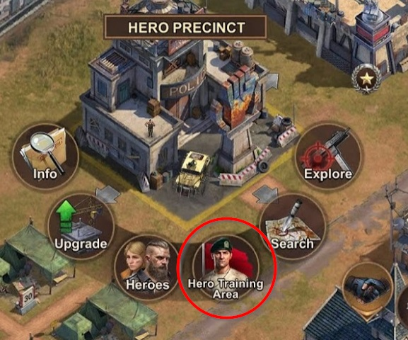
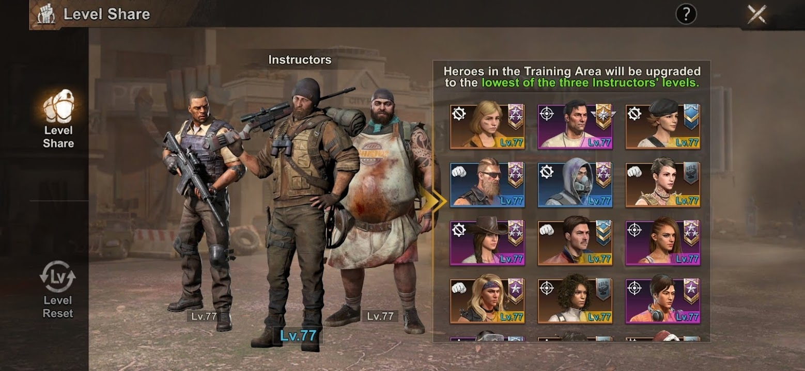
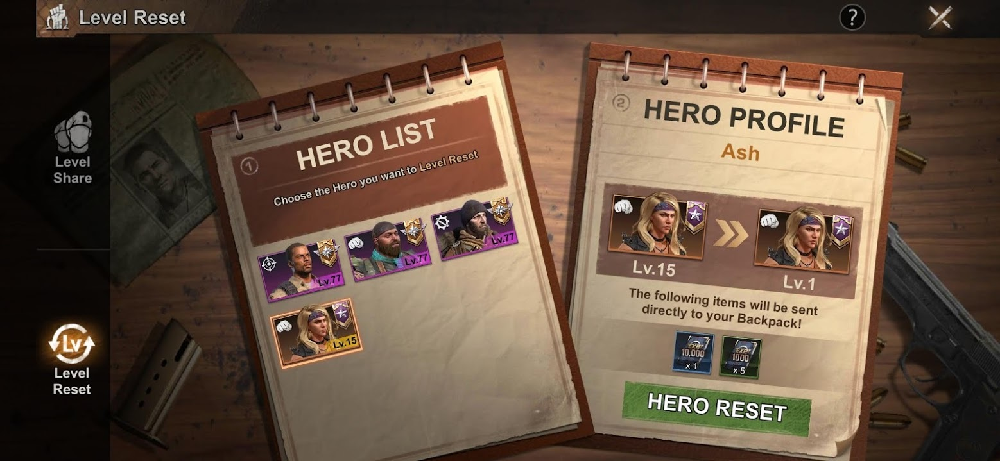

# Hero Training Area

As you upgrade the level of your Hero Precinct a number of "slots" are opened to allow your Hero's to take on the lowest level of your 3 Hero Instructors. The 3 Heros that you have levelled up the highest will automatically be selected as your Instructors - I suggest that you reset the level of all of your heros except the 3 that you are able to rank up the easiest (for me this was Chef, Mike and Travis as I received an abundance of their fragments through Daily Intel and Hunting the Hunter events)

## Access the Hero Training Area
Click on the Hero Precinct and select the Hero Training Area

## Adding or Removing Heros from the Training Area

Instructors are shown on the left. Heros can be added or removed on the right
> NOTE: There is a 24 hour cooldown on each "slot" when you remove a hero

## Reset Hero Level

To reset the level of a Hero and retrieve the Hero XP to use towards another one select the Hero and press the *Reset* button. It is a good idea to periodically reset the level of all Hero's who are not your Instructors
> NOTE: There is a 7 day cooldown when resetting a Hero's level