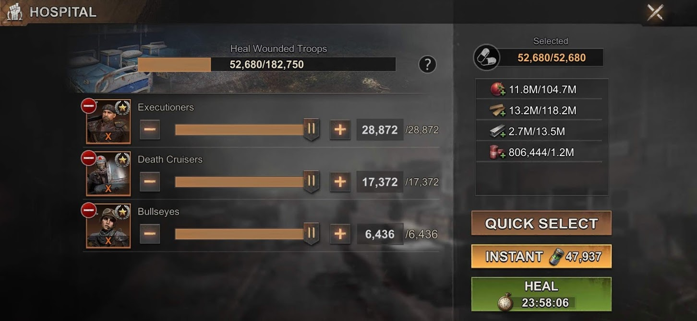

# Hospital Overview

1. Hospital capacity (*add link to Enlistment docs - what happens if your hospital is full*)
2. Total number of troops in your hospital
   
3. Total number of troops (of all ranks/types) selected to be healed in one batch
   
4. Total amount of your resources (as seen at the top of your screen)
5. The resource cost of healing the currently selected batch of troops

6. Troops in hospital (organised by rank, then type)
7. Number of troops of each rank/type selected to be healed in one batch
8. Total number of troops of that rank/type in the hospital
   
9.  Quick select will alternate between selecting all, none and the amount that you have enough resources to heal
10. Pressing Instant will use the amount of biocaps displayed to instantly heal your troops (I don't suggest using this)
11. The amount of time it will take to heal the currently selected batch of troops

> TIP: See [Batch Healing](batch_healing.md) for information on how to heal quickly