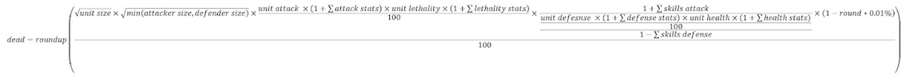

# Battle Simulator

This simulator was created to model different battle scenarios (PVP, Infected etc.) This is a very complex topic which is why it's very difficult to provide an answer to the question "what is the best formation to use?".

Here is one of the formulas used in the game to determine who many troops die for example:

Battle Mechanics:
[Battle Mechanics](https://en.ultimate-guide.ovh/fights/battle-mechanics)

Guide:
[Battle Simulator Guide](https://en.ultimate-guide.ovh/fights/battle-simulator)

Simulator:
[Battle Simulator](https://soscompanion.com/State-of-Survival-Building-Time-Resources-Calculator)