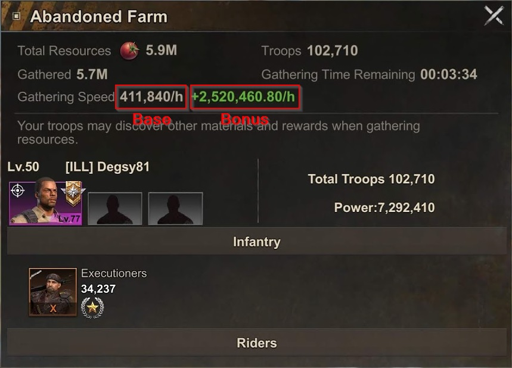
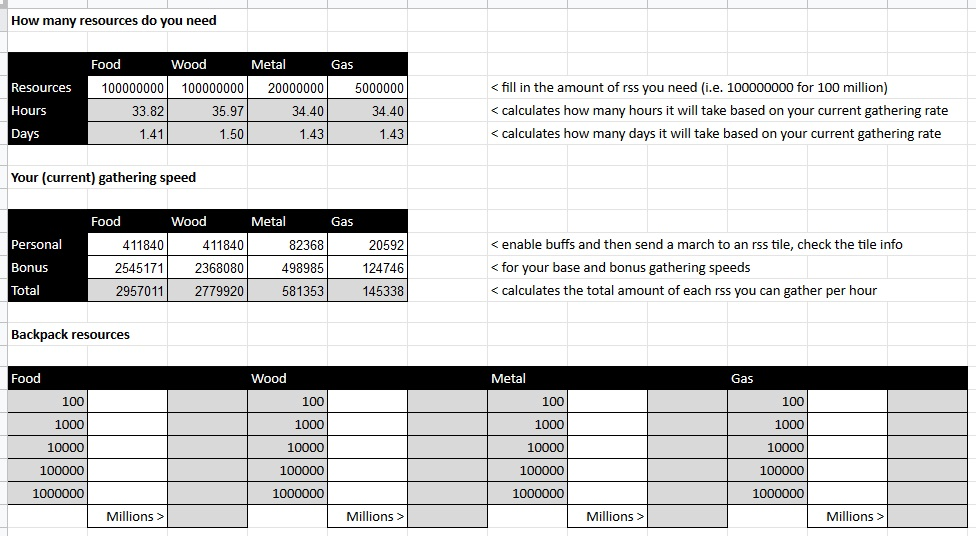

# Resource Tools

## Resource Calculator v1

Fill in how many resources you need, how many resources you have (optional) and how quickly you can gather resources and the calculator will tell you how long it will take for you to gather that amount of resources. Your gathering speed can vary day by day dependant on the hero you choose for a particular rss type, research you have done, the talent tree you have selected, buffs you have activated, alliance benefits etc.

To find your gathering speed for a particular rss type:

Send a march to the rss tile(s) that you need to gather. Click on the tile once the march has reached it and click info

On the spreadsheet fill in only the white cells, grey cells contain pre-populated information or formulas. Populate the resource types you need to gather for and your gathering speeds from the steps above.

The "Backpack Resources" section can be used to work out how many resources you have in your backpack that you can put towards whatever you are saving up for :-)

[Gathering Calculator Spreadsheet](https://docs.google.com/spreadsheets/d/1F8HwlBGfFICZdx2bOdA5UQaQpc95wnJSwRKRkdxQ8xY/edit?usp=sharing)

Download the spreadsheet to your PC/phone or make a copy of it to your Google account