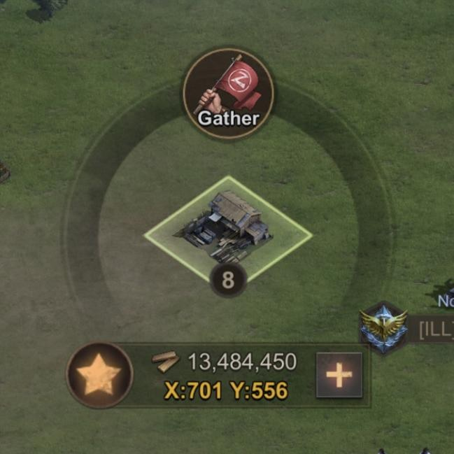
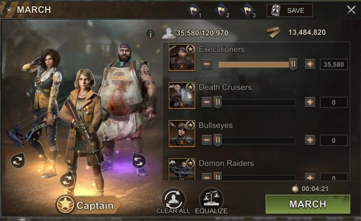

# Gathering Resources

State of Survival offers 4 different types of resources (abbreviated as rss in game - link to abbreviations section), in addition to plasma (link plasma section). Resources are used to level up buildings, train and heal troops, recon other people and can even be traded at the market stall.

Food, Wood, Metal and Gas can be collected in several different ways - Daily Intel, Infected Fiends, Plague Zones, Contests, Festivals and Events all provide opportunities to win a random amount of rss. However unless you also gather it will take a long time to build up enough to preform higher level building and troop upgrades. 

Gathering is the fastest way to accumulate rss. To gather most efficiently make sure to switch talent points to the Economy tree (link to talent point guide) and apply a gathering speed buff found under settlement buffs (link to buffs guide). Additionally, researching Haulage abilities under the Economic tab in the Research Lab will help greatly (link to research guide).

Resource tiles come in different tiers from 1 to 8 - the higher the number, the more rss it holds. Always make sure that you fully clear an rss tile especially tier 7s and 8s as they don't regenerate for a long time if they're left with some rss still on them.

* Click an rss tile

* Now you need to pick the best formation of heros and troops to gather the rss

> TIP: Using the right hero for the right type of rss will add 20% to your gathering speed. Mike = Food, Chef = Wood, Rusty = Metal, Ghost = Gas

The process I use is to click *Clear* > select one hero (check the tip above for the right one) > if you have a large amount of troops you can simply click *Equalise* and it will split your troops by the number of marches you have. If you want to keep some troops in your settlement to protect your rss use the sliders to adjust the amount of troops you're sending until it is just enough to clear the tile (check the figure in the top right corner against the amount of rss on each tile)

> TIP: Sending more than one hero or more troops than is necessary to clear the tile does not speed up the gathering process